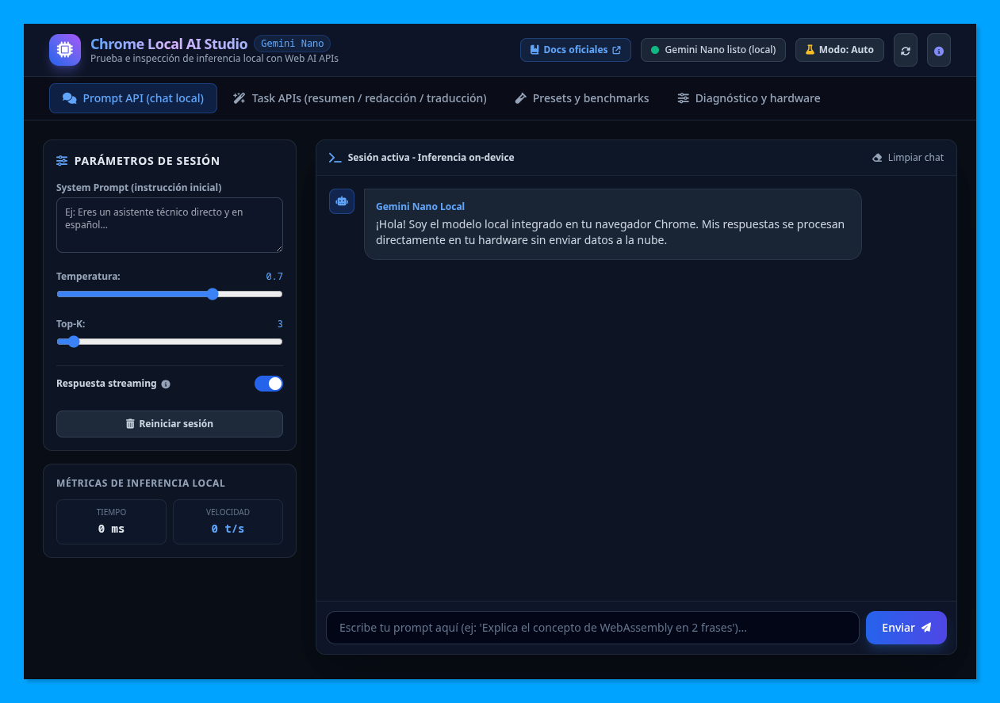
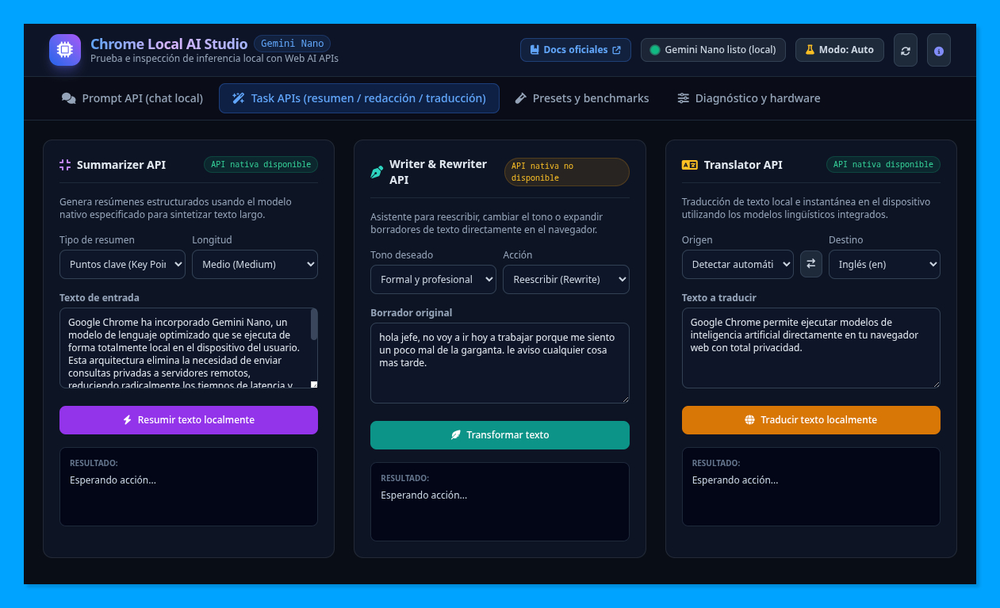
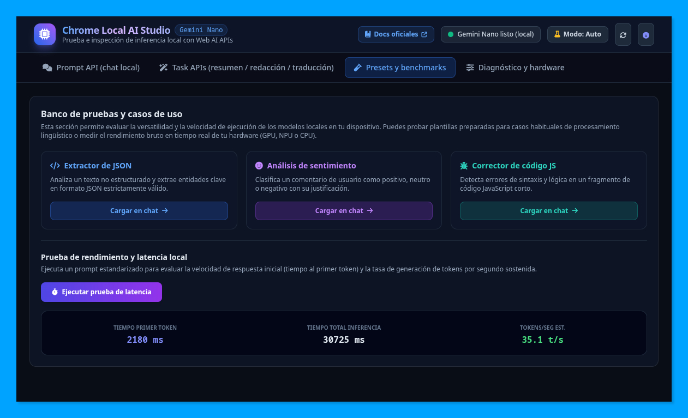
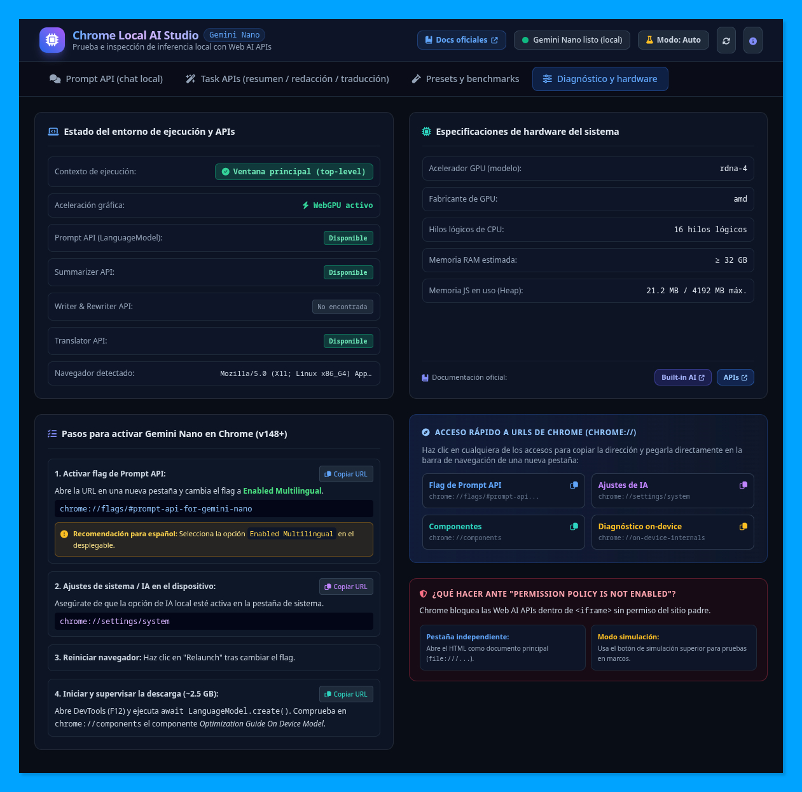

# Entorno de prueba e inspección de inferencia local con Chrome Built-in AI

[](https://pfelipm.github.io/chrome-ia-local-demo/)
[](https://www.gnu.org/licenses/agpl-3.0)
[](https://developer.chrome.com/docs/ai/built-in)
[](https://www.w3.org/TR/webgpu/)

Una aplicación web interactiva (*single-page application*) diseñada para explorar, inspeccionar y evaluar el rendimiento de los modelos de inteligencia artificial integrados directamente en el navegador Google Chrome mediante la **Prompt API** y las **Task APIs** (*Summarizer*, *Writer/Rewriter*, *Translator* y *Language Detector*), impulsadas por **Gemini Nano**.

> 🌐 **Demostración en vivo:** Puedes acceder a la herramienta directamente en [https://pfelipm.github.io/chrome-ia-local-demo/](https://pfelipm.github.io/chrome-ia-local-demo/).

---

## Índice

- [El cambio de paradigma: inferencia local en el navegador](#el-cambio-de-paradigma-inferencia-local-en-el-navegador)
- [Requisitos de ejecución](#requisitos-de-ejecución)
- [Guía de activación paso a paso en Google Chrome](#guía-de-activación-paso-a-paso-en-google-chrome)
- [Funcionalidades y módulos de la herramienta](#funcionalidades-y-módulos-de-la-herramienta)
  - [1. Chat interactivo con Prompt API](#1-chat-interactivo-con-prompt-api)
  - [2. Task APIs especializadas](#2-task-apis-especializadas)
  - [3. Banco de pruebas y casos de uso](#3-banco-de-pruebas-y-casos-de-uso)
  - [4. Diagnóstico y hardware del sistema](#4-diagnóstico-y-hardware-del-sistema)
  - [5. Modo simulación inteligente](#5-modo-simulación-inteligente)
- [Arquitectura técnica](#arquitectura-técnica)
- [Documentación oficial y referencias](#documentación-oficial-y-referencias)
- [Licencia](#licencia)

---

## El cambio de paradigma: inferencia local en el navegador

Tradicionalmente, incorporar capacidades de modelos de lenguaje (LLM) en aplicaciones web requería enviar las peticiones a servidores remotos a través de APIs en la nube. Este enfoque, aunque potente, presenta importantes inconvenientes: latencia de red, dependencia de conexión constante, costes recurrentes por consumo de tokens y, fundamentalmente, la necesidad de transferir datos privados del usuario a terceros.

La iniciativa **Chrome Built-in AI** y los estándares de **Web AI APIs** de la W3C transforman este modelo al embeber **Gemini Nano** directamente en el motor de renderizado de Chrome:

1. **Privacidad por diseño (*zero-data egress*):** Los textos, conversaciones y datos procesados se ejecutan y quedan confinados en la memoria del dispositivo del usuario.
2. **Coste marginal cero:** La inferencia la asume el hardware local del cliente, eliminando costes de servidor y cuotas de facturación por token.
3. **Disponibilidad sin conexión (*offline-first*):** Una vez descargado el modelo local (~2.5 GB), la aplicación funciona de forma completamente autónoma sin acceso a internet.
4. **Aceleración por hardware:** Aprovecha la GPU, NPU o CPU del equipo mediante WebGPU y compilaciones optimizadas para inferencia en tiempo real.

---

## Requisitos de ejecución

Para ejecutar la inferencia local real con Gemini Nano en tu equipo se requiere:

* **Navegador compatible:** Google Chrome (versión 128 o superior, preferentemente canales Dev / Canary o versiones estables recientes con soporte experimental).
* **Espacio en disco:** Alrededor de 2.5 GB a 3 GB de espacio libre para la descarga y almacenamiento local de los pesos del modelo de IA.
* **Aceleración gráfica:** GPU o NPU con soporte para WebGPU / DirectX 12 / Vulkan / Metal.
* **Memoria RAM:** Se recomiendan al menos 8 GB de memoria RAM en el sistema (preferiblemente 16 GB).

---

## Guía de activación paso a paso en Google Chrome

Debido a que las Web AI APIs se encuentran en fase experimental / vista previa para desarrolladores, es necesario habilitar los correspondientes flags en el navegador:

### 1. Activar el flag de la Prompt API
Copia la siguiente dirección en la barra de direcciones de Chrome:
```text
chrome://flags/#prompt-api-for-gemini-nano
```
* Cambia su valor a **`Enabled Multilingual`** (recomendado para soporte en español e internacional) o **`Enabled`**.

### 2. Verificar ajustes de IA del sistema (Chrome 148+)
En las versiones más recientes de Chrome, comprueba en la configuración:
```text
chrome://settings/system
```
Asegúrate de que la opción de ejecución de IA en el dispositivo esté activada.

### 3. Reiniciar el navegador
Haz clic en el botón **Relaunch** al pie de la página de flags para reiniciar Chrome y aplicar los cambios.

### 4. Forzar y supervisar la descarga del modelo
Abre las herramientas de desarrollo de Chrome (F12) en cualquier pestaña y ejecuta en la consola:
```javascript
await window.ai.languageModel.create();
```
O en la sintaxis de versiones actualizadas:
```javascript
await LanguageModel.create();
```
Puedes monitorizar el estado de la descarga accediendo a:
```text
chrome://components
```
Busca el componente **Optimization Guide On Device Model** y verifica que su estado sea *«Up-to-date»* (Actualizado).

---

## Funcionalidades y módulos de la herramienta

La aplicación está organizada en 4 pestañas interactivas diseñadas para cubrir desde la experimentación abierta hasta la telemetría detallada de rendimiento:

### 1. Chat interactivo con Prompt API



* **Conversación en tiempo real:** Permite dialogar libremente con Gemini Nano en local.
* **Soporte de streaming:** Visualización fluida palabra por palabra (*token by token*) a medida que el modelo genera la respuesta.
* **Control de hiperparámetros:**
  * *System prompt*: Instrucciones de contexto y rol para guiar el comportamiento del modelo.
  * *Temperatura*: Ajuste de creatividad y aleatoriedad (0.0 = determinista, 1.0 = creativo).
  * *Top-K*: Control del muestreo de candidatos más probables.
* **Métricas en tiempo real:** Medición automática del tiempo al primer token (*Time to First Token* - TTFT), tiempo total de inferencia, recuento estimado de tokens y tasa de generación en tokens/segundo.

### 2. Task APIs especializadas



Demostración de las APIs de alto nivel orientadas a tareas lingüísticas concretas:
* **Summarizer API:** Generación de resúmenes locales configurando el formato (viñetas, párrafos, titulares) y la longitud deseada.
* **Writer & Rewriter API:** Asistente de redacción para transformar borradores, expandir ideas o adaptar el tono (formal, casual, asertivo).
* **Translator API & Language Detector API:**
  * Traducción instantánea entre múltiples idiomas (español, inglés, francés, alemán, japonés).
  * Opción de **autodetección inteligente** del idioma de origen mediante la `LanguageDetector API`.
  * Botón de **intercambio rápido** de idiomas ($\rightleftarrows$).
  * **Deshabilitación dinámica** de opciones para impedir selecciones redundantes del mismo idioma de origen y destino.
* **Gestión de fallbacks transparentes:** Si la API nativa de una tarea no está disponible, el sistema utiliza inteligentemente la *Prompt API* de Gemini Nano o el modo simulación, indicando el método exacto con un distintivo visual (*badge*).

### 3. Banco de pruebas y casos de uso



* **Plantillas preconfiguradas (*presets*):**
  * *Extractor de JSON:* Análisis de texto desestructurado para generar estructuras JSON válidas.
  * *Análisis de sentimiento:* Clasificación de opiniones en positivo, neutro o negativo con razonamiento.
  * *Corrector de código JavaScript:* Detección y corrección de errores de sintaxis y lógica en código fuente.
* **Prueba de rendimiento y latencia (*benchmark*):** Ejecución de una batería de inferencia estandarizada que mide la velocidad sostenida en tokens por segundo y la latencia del hardware local.

### 4. Diagnóstico y hardware del sistema



* **Inspección de hardware en tiempo real:**
  * *Acelerador gráfico (GPU):* Fabricante y modelo comercial detectado mediante WebGPU y WebGL.
  * *Capacidad de CPU:* Número de hilos lógicos del procesador (`navigator.hardwareConcurrency`).
  * *Memoria RAM:* Estimación de memoria del sistema y uso de memoria Heap de JavaScript.
* **Estado de las APIs:** Chequeo en vivo de la disponibilidad de cada una de las Web AI APIs.
* **Gestión de *Permission Policy* en iframes:** Identificación de restricciones de marcos anidados con guías claras para su resolución.
* **Copiado rápido de URLs `chrome://`:** Acceso directo con un solo clic a las herramientas internas del navegador (`flags`, `components`, `settings`, `on-device-internals`).

### 5. Modo simulación inteligente
Para permitir la exploración de la interfaz, el flujo de streaming y la medición de la UI en navegadores donde Gemini Nano aún no está disponible o durante revisiones rápidas, la herramienta incluye un **modo simulación** activable con un solo clic desde la cabecera.

---

## Arquitectura técnica

La aplicación está construida siguiendo los principios de simplicidad, rendimiento y máxima portabilidad:

* **Arquitectura de archivo único:** Todo el código (HTML, CSS y JavaScript) reside en [`index.html`](index.html), facilitando su distribución, ejecución local (`file:///`) o despliegue estático sin necesidad de pasos de compilación (*buildless*).
* **Librerías y recursos:**
  * [Tailwind CSS](https://tailwindcss.com/) (CDN) para una interfaz con modo oscuro y diseño responsive adaptado a cualquier resolución.
  * [Font Awesome 6](https://fontawesome.com/) para iconografía técnica.
  * [Marked.js](https://marked.js.org/) para renderizado en vivo de respuestas en formato Markdown.
* **Manejo robusto de errores:** Bloques `try...catch...finally` que garantizan la reactivación de controles e indicadores visuales de progreso (*spinners*) ante cualquier excepción de inferencia.

---

## Documentación oficial y referencias

Para profundizar en la especificación y desarrollo de aplicaciones con IA local en Chrome:

* [Chrome Built-in AI - Documentación oficial de Google](https://developer.chrome.com/docs/ai/built-in)
* [Referencia de Web AI APIs en Chrome for Developers](https://developer.chrome.com/docs/ai/built-in-apis)
* [Explicación de la Prompt API (W3C Web Incubator Community Group)](https://github.com/explainers-by-googlers/prompt-api)
* [Especificación de WebGPU (W3C)](https://www.w3.org/TR/webgpu/)

---

## Licencia

Este proyecto se distribuye bajo los términos de la licencia **GNU Affero General Public License v3.0 (AGPLv3)**. Consulta el archivo [LICENSE](LICENSE) para más detalles.
